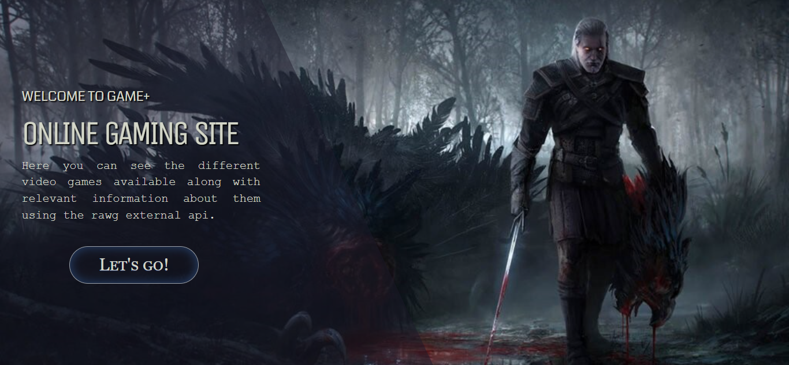

    

# Individual Project - Henry Videogames

  

<!-- 

  

 -->

<video src="demo.mp4" height="480"></video>

  

    <a  title="Deploy" href="https://game-app-rosy.vercel.app" target="_blank" rel="noreferrer" >
      <h1>Check it out!</h1>
    </a>
  

## Statement
Game+ is an application in which you can see the different video games available along with relevant information about them using the [rawg](https://rawg.io/apidocs) external api and from it you can, among other things:

  - Add new videogames
  - Filter or Sort
  - Search 
 
 
#### Technologies:
- [ ] React
- [ ] Redux
- [ ] Express
- [ ] Sequelize - Postgres

#### Frontend

The React/Redux app contains the following routes:

__Landing page__: 
- [ ] Button to enter the home ( `Main Path` )

__Home__: 
- [ ] Search input to find video games by name
- [ ] Area where the list of video games is with their information such as:
  - Name
  - Genres
  - Rating
  - Release
- [ ] Options to filter by genre and by existing or created video game
- [ ] Options to sort both ascending and descending video games by alphabetical order and by rating
- [ ] Paging to search and display the following video games, 15 games per page, showing the first 15 on the first page.

__Game detail__:
- [ ] Los campos mostrados en la ruta principal para cada videojuegos (imagen, nombre, y géneros)
- [ ] Description
- [ ] Release date
- [ ] Rating
- [ ] Platforms

__Game Creation__: 
- A form __JavaScript controlled__ with:
- [ ] Ability to select/add multiple genres
- [ ] Ability to select/add multiple platforms
- [ ] Button/Option to create a new video game

#### Database

The database model with Postgres and Sequelize

#### Backend

A server was developed in Node/Express with the following routes:

#### Testing
- [ ] Unit tests for backend routes with their respective tests with "Chai"
- [ ] Unit tests for database model with its tests with "Chai"
